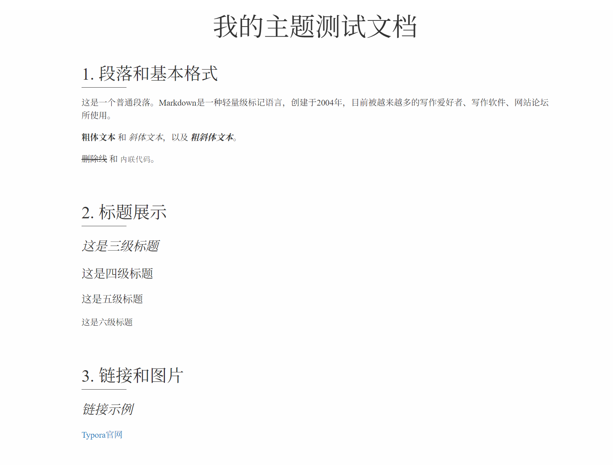
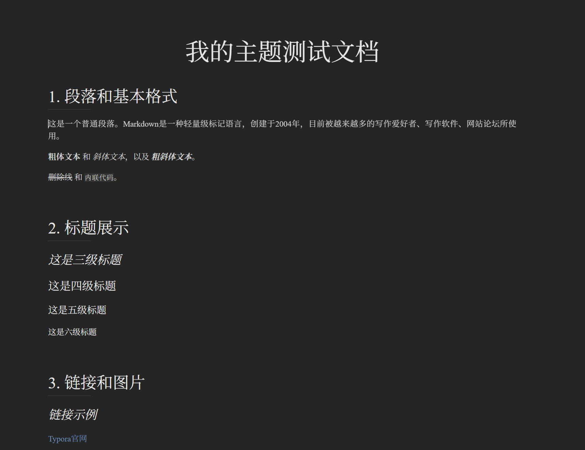

# 我的 Typora 主题

这是一个为 Typora Markdown 编辑器设计的主题，提供了明亮和暗色两种风格。

## 预览

### 明亮主题

### 暗色主题

## 安装方法

1. 下载本仓库中的主题文件
2. 打开 Typora，点击 "文件 -> 偏好设置"（Windows/Linux）或 "Typora -> 偏好设置"（macOS）
3. 点击 "外观 -> 打开主题文件夹"
4. 将下载的主题文件（CSS文件和字体文件夹）复制到打开的主题文件夹中
5. 重启 Typora
6. 在 Typora 的 "主题" 菜单中选择 "my-theme" 或 "my-theme-dark"

## 特点

- 清晰易读的排版
- 精心选择的颜色方案
- 代码块语法高亮
- 针对各种 Markdown 元素优化的显示效果
- 支持数学公式、表格等高级功能
- 适合阅读和写作

## 自定义

如果你想调整主题，可以编辑 CSS 文件：

- `theme/my-theme.css` - 明亮主题
- `theme/my-theme-dark.css` - 暗色主题

主要颜色和字体变量都在 CSS 文件的 `:root` 部分定义，可以根据个人喜好进行修改。

## 许可证

MIT

## 示例文件

查看 `example.md` 文件可以预览主题对各种 Markdown 元素的渲染效果。 